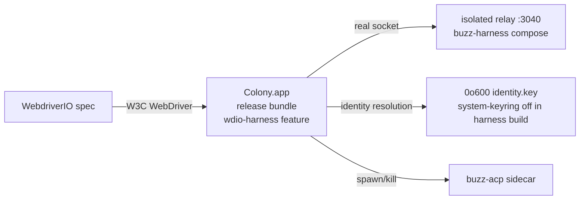

# Real-shell E2E harness (Phase 0.4)

A second, deliberately small desktop suite with a different job than the 136
Playwright specs in `tests/e2e/`: it drives a **packaged Tauri build** with a
**real backend**. No dev server, no `e2eBridge.ts` mock, no `__TAURI_INTERNALS__`
interception. The mock suite proves the frontend; this suite proves the shell.



## The seven flows

| Flow | Spec | Reaches (nothing the mock can touch) | What it catches if it breaks |
| --- | --- | --- | --- |
| 01 launch → first paint | `specs/01-launch.spec.ts` | Boot, identity resolution, window creation | App won't start; window never shows; identity resolution deadlocks boot or trips the keyring-locked recovery |
| 02 onboard identity | `specs/02-identity.spec.ts` | Boot identity resolution (keychain-backed where reachable, 0o600 file fallback otherwise); onboarding; restore across launches | Identity resolution broken; onboarding broken; identity lost between launches |
| 03 join + message | `specs/03-messaging.spec.ts` | Live relay socket and push; real ingestion | Relay URL resolution broken; socket layer broken; event sign/publish broken |
| 04 agent spawn/stop | `specs/04-agent.spec.ts` | Sidecar spawn, protected PID set, reaper | Sidecar bundling broken; spawn env broken; stop/reaper leaks processes. The spec pins the agent's ACP command to the bundle's own `Contents/MacOS/buzz-acp`: on a dev machine the app's workspace-command resolution would otherwise prefer a leftover `target/release/buzz-acp` from the build that produced the bundle, proving nothing about the packaged app (an installed app has no workspace dirs, so it resolves the same bundled binary the pin selects) |
| 05 huddle + transmit | `specs/05-huddle.spec.ts` | Audio devices, the raw binary IPC path | Huddle join broken; audio capture broken; binary IPC path broken |
| 06 terminal PTY + normal exit | `specs/06-workspace-terminal.spec.ts` | Packaged xterm renderer, real PTY prompt/input/output, inactive-tab remounts, all-session community cleanup, Cmd +/- zoom, normal Tauri exit | Terminal is mocked, sessions leak across a community boundary, zoom is not computed from the root, or RunEvent exit cleanup misses a PTY |
| 07 terminal PTY + SIGTERM | `specs/07-workspace-terminal-sigterm.spec.ts` | Separate packaged launch, real terminal leaders/descendants, Unix SIGTERM handler | Signal shutdown leaves a terminal process tree alive |

Each flow starts the app fresh (one spec per launch). State persists across
flows inside a single run: 02 creates the identity, 03 proves it restores and
joins the community, 04 and 05 start from the joined state, and 06/07 exercise
the joined community with real terminal sessions.

## How it works

- **Driver**: `@wdio/tauri-service` with the **embedded** WebDriver provider.
  `tauri-plugin-wdio-webdriver` runs a W3C WebDriver HTTP server inside the
  app (this is how macOS is supported — classic `tauri-driver`/safaridriver
  cannot drive an embedded WKWebView). No external driver is installed.
- **Plugins**: `tauri-plugin-wdio` + `tauri-plugin-wdio-webdriver` are
  compiled in only under the `wdio-harness` Cargo feature
  (`desktop/src-tauri/Cargo.toml`), and the matching capability is
  materialized from `capabilities/wdio.json.harness` only for harness builds
  (`scripts/build-real-shell-app.sh`). Shipping builds never contain the
  WebDriver server.
- **Harness app identity**: the build overrides the bundle identifier to
  `xyz.block.buzz.app.harness`, so WebKit storage, app data, and TCC state are
  separate from the real app. It is never installed — it runs from the build
  directory.
- **Keychain policy (Phase 0)**: the suite never switches the machine's
  default keychain and never mutates any keychain item — that is machine-
  global state and requires an explicit decision. A release build hardcodes
  keyring service `buzz-desktop` (`app_state_keyring.rs`), and keyring 3.x
  resolves the user-domain default keychain; an ad-hoc-signed binary probing
  the production item can block for minutes on the Security Server (observed
  during Phase 0 — boot stuck in `SecKeychainFindGenericPassword`). The
  harness build therefore disables the crate's `system-keyring` feature
  (`--no-default-features`, see `scripts/build-real-shell-app.sh`), so
  `probe()` returns `Unreachable` without calling the Security Server and
  identity resolution exercises the app's real `0o600` identity.key path
  (`load_file_or_generate`). Flow 02 still probes the production OS-keychain
  item READ-ONLY (timeout-bounded) and records the keychain leg as a LOUD
  skip when the harness is not keychain-backed. Closing the keychain leg
  would take: (a) a release build variant that honors
  `BUZZ_DEV_KEYRING_SERVICE` (separate PR — it changes how the shipping
  build resolves the store holding users' private keys), or (b) a user
  decision to allow switching the default keychain to an ephemeral file for
  the duration of the run.
- **Backend**: the repo's isolated relay harness
  (`scripts/start-isolated-test-relay.sh`, tmux `dawn-relay-3040`,
  `buzz-harness` compose: postgres :5481, redis :6481, minio :9481,
  MinIO console :9492, relay :3040, health :8098, metrics :9212). A live
  relay on :3040 is reused as-is; without tmux
  the orchestrator falls back to an inline nohup launch of the same stack.
  The seed (`setup-desktop-test-data.sh`) registers the test community for
  BOTH `localhost:3040` and `127.0.0.1:3040`: the app connects via
  `localhost`, while the managed-agent runtime canonicalizes relay URLs to
  `127.0.0.1` (`buzz_core::relay::normalize_relay_url`) before injecting
  them into the sidecar, and the relay is host-scoped — a sidecar connecting
  to the 127.0.0.1 spelling would 404 without the second tenant.

## Prerequisites

- macOS (Phase 0 is macOS-only; Windows/Linux come in Phase 3)
- Docker (relay backing services), hermit (`./bin/activate-hermit`)
- A first `cargo build` of the desktop crate + sidecars (tens of minutes cold)

## Run it

```bash
./bin/activate-hermit
./scripts/run-real-shell-e2e.sh
```

Options:

```bash
./scripts/run-real-shell-e2e.sh --flow 03            # just the messaging flow
./scripts/run-real-shell-e2e.sh --no-build           # reuse an existing harness app
BUZZ_REAL_SHELL_RELAY_MODE=nohup ./scripts/run-real-shell-e2e.sh  # skip tmux path
```

The orchestrator: ensures the relay → builds the harness app → resets harness
state → runs each flow → prints a loud per-flow summary
(`desktop/e2e-real-shell/results/flow-results.jsonl`).

While `build-real-shell-app.sh` runs, do not start other desktop-crate cargo
builds (`just ci`, `cargo clippy`/`cargo test` in `desktop/src-tauri`) on the
same checkout — the harness build materializes `capabilities/wdio.json`,
which only exists to carry the `wdio:*` permissions and makes a
default-feature build fail with `Permission wdio:default not found`. CI never
runs them concurrently; locally, sequence them.

## Resetting state between runs

The orchestrator resets everything automatically on every run:

- harness app data (`~/Library/Application Support|Caches|WebKit|HTTPStorages|...`
  for `xyz.block.buzz.app.harness`)
- the isolated relay database is reset by `start-isolated-test-relay.sh` on
  the tmux path; the nohup path resets it only when the database is owned by
  this run (never another worktree's)

The real app's state and keychain are never touched. To reset the real app
manually, use the repo's `scripts/reset-desktop-standalone-state.sh`.

## Skips and flakes (design intent)

Real audio devices, real keychains and a real relay are slower and flakier
than the mocked suite. That is expected. Rules:

- **Skips are loud.** A flow that cannot run (e.g. flow 05 with no audio
  input device, or CI without mic permission) writes a `[REAL-SHELL SKIP]`
  line to the summary — it never silently reads as coverage.
- **Quarantine, don't delete.** If a flow flakes, mark it quarantined in the
  orchestrator (see `FLOWS`), not deleted from the suite.
- **Per-flow logs**: `desktop/e2e-real-shell/results/<flow>.log` plus failure
  screenshots in the same directory.

## CI

`.github/workflows/ci.yml` runs the suite on `macos-latest` as
`real-shell-e2e`, **non-blocking** (`continue-on-error`) because it is new,
slow (cold macOS builds), and touches real devices/keychains. What would make
it gating: a reliable macOS runner with Docker + mic access (or a
quarantined flow 05), a warm cargo cache, and a couple of green weeks of
history.

## Known limits (Phase 0)

- macOS only; Windows/Linux runners come with Phase 3.
- Flow 05's transmit sub-assertion depends on OS microphone permission (TCC).
  CI runners typically have no mic — the flow skips loudly there. When the
  per-app TCC prompt is unanswered or denied, the relay-side huddle join
  still succeeds but the capture pipeline never confirms active; the spec
  detects the permission state (`navigator.permissions` in the app webview)
  and writes a `[REAL-SHELL SKIP]` with the exact reason — a granted
  permission with an unavailable mic is a FAIL (audio pipeline regression),
  not a skip.
- The relay needs Docker for postgres/redis/minio; the relay itself has no
  embedded store.
- The 136 Playwright specs are untouched and keep testing the frontend
  against the mock — this suite is deliberately not a port of them.

## Known gap: CI has no backend on GitHub-hosted macOS runners

The `Real-shell E2E (macOS)` job stands up the isolated relay stack with Docker
via Colima. GitHub's hosted macOS runners do not reliably provide the nested
virtualisation Lima needs, so `colima start` fails outright:

```
level=fatal msg="error starting vm: error at 'creating and starting': exit status 1"
```

The job detects this and records a loud skip (a `status:"skip"` ledger entry plus
a workflow warning) instead of failing, because a red X there would mean "this
runner has no Docker", not "the shell is broken". The job is also
`continue-on-error: true`, so it cannot gate the repo while this stands.

**What would make it gating**, in preference order:

1. A self-hosted macOS runner with Docker already installed. Closest to the
   local setup this harness was built and proven against.
2. A long-lived hosted relay the job points at instead of standing one up.
   Removes Docker from the job entirely, at the cost of test isolation.

Until one of those exists, this job proves nothing about the shell in CI. Run it
locally against a packaged build; that path is green and is what Phase 0 relies on.
