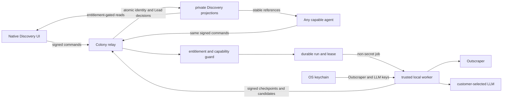

# Colony Discovery: Outscraper Businesses Production Slice

**Date:** 2026-08-02

**Status:** Product contract approved; Outscraper source gate execution in
progress

**Repository:** `nocodeafrica/Colony`

**Branch:** `codex/discovery-next`

## Outcome

Deliver Colony's first real Discovery path: an entitled person or capable agent
can run a Businesses Campaign against Outscraper, qualify net-new candidates
with the customer's locally configured LLM, and see qualified results become
Leads automatically.

This slice does not add People discovery, Outreach, a CRM pipeline, provider
credits, checkout, or relay custody of customer API keys.

## Settled product contract

- Live Discovery requires an active paid LAKA entitlement.
- Free Colony users see the existing zero-cost fixture demo only.
- Customers pay Outscraper and LLM usage directly through their own accounts.
- Outscraper and LLM keys remain on the user's trusted device in the operating-
  system keychain.
- The relay never receives, stores, logs, synchronizes, or backs up secret
  values.
- Live runs require an online trusted Colony desktop/local worker.
- Any agent with the generic Discovery capability can operate the same
  primitive; the Lead Specialist merely receives that capability by default.
- There is no per-run approval prompt. Capability assignment, Campaign limits,
  and subscription status are the approval boundary.
- Qualified net-new Businesses become Leads automatically.
- Paid-for normalized records and qualification evidence remain stored; there
  is no automatic age-based deletion.
- Workspace-wide duplicates are not saved again, linked to another Campaign,
  or qualified again. They do not count toward the Campaign target.
- Subscription revocation immediately cancels active work and locks all
  Discovery records. Renewal restores them. Converted Clients remain ordinary
  Colony data.

## Current code boundary

### Already implemented in Colony

The foundation provides signed private start, status, and cancel actions;
durable run records; entitlement and generic agent-capability enforcement;
idempotency; leased restart-safe execution; fencing; cancellation; immediate
revocation; CLI commands; and real-relay privacy/fault-injection coverage.

The complete SalesTeams-style frontend remains behind the provider-neutral
`DiscoveryDataSource` interface with deterministic fixtures and an
`AsyncIterable<DiscoveryEvent>` run stream.

### Separate worktree

`/Users/mac/Desktop/Billion/AI-Native-Ventures-App-worktrees/discovery-engine`
was rechecked read-only at `fa52ff60d`. It is clean and contains the already
merged UI parity work, not a competing live provider engine. It must not be
modified from this worktree.

### SalesTeams implementation knowledge reused

The actual SalesTeams code establishes useful provider behavior:

- Outscraper's `/maps/search-v3` request and asynchronous polling flow;
- normalized Google place, contact, location, rating, hours, and media fields;
- bounded retry and rate-limit classification;
- provider request identifiers and usage observations;
- campaign source configuration and progress vocabulary;
- qualification before Lead acceptance;
- provider-ID, domain, phone, name, and location identity evidence;
- net-new target accounting and source exhaustion behavior.

Colony does not copy SalesTeams' Supabase clients, RLS, RPCs, service-role
access, Realtime/SSE transport, Redis cache, Trigger.dev jobs, platform credit
deduction, or server environment-variable secret custody.

## Architecture

### Responsibility split

The relay is authoritative for:

- Campaigns and their target, taxonomy, geography, and qualification criteria;
- entitlement and per-agent Discovery capability;
- run state, attempts, leases, fencing, checkpoints, cancellation, and restart;
- canonical workspace Business identity and suppression;
- qualification decisions, Leads, Campaign counts, usage evidence, and
  provenance;
- private reads and stable Campaign, run, Business, and Lead references.

The trusted local worker is authoritative only for executing a current lease:

- reading local keychain credentials;
- building bounded Outscraper requests from the Campaign;
- submitting and polling Outscraper jobs;
- normalizing provider responses;
- applying deterministic hard filters;
- batching LLM qualification for candidates the relay has reserved as net-new;
- sending signed, fenced checkpoints and results back to the relay.

The worker does not decide whether a Business is globally new and does not
directly persist Leads. Those decisions remain atomic at the relay so two
workers or agents cannot create duplicates concurrently.

## Production data model

The existing run tables are extended or accompanied by private relay
projections for:

- `discovery_campaigns`: Businesses-only Campaign definition, owner workspace,
  taxonomy IDs, geography, target, qualification prompt/version, and status;
- `discovery_runs`: existing durable lifecycle plus current phase and counts;
- `discovery_run_attempts`: fenced worker lease and recovery history;
- `discovery_source_attempts`: Outscraper query, opaque provider request ID,
  page/batch state, returned count, and error classification;
- `discovery_businesses`: one canonical normalized Business per workspace;
- `discovery_business_observations`: retained source fields, provider IDs,
  provenance, observed time, and the complete business-relevant normalized
  result—not headers, keys, or arbitrary network traces;
- `discovery_suppressions`: identity fingerprints for existing Leads, rejected
  or uncertain candidates, dismissed records, and converted Clients;
- `discovery_qualifications`: structured verdict, reason, confidence, model
  identifier, prompt version, and non-secret evidence;
- `discovery_leads`: the qualified Business-to-Campaign result and its stable
  Colony reference;
- `discovery_usage`: records requested/returned, candidates reserved,
  qualification evaluations, duplicates, rejects, and Leads saved.

The model uses ordinary Colony Postgres migrations and relay database modules.
It does not reproduce Supabase RLS or RPC structure.

## Identity and net-new semantics

Each normalized candidate is submitted to the relay before an LLM call. The
relay atomically reserves it as net-new or reports it suppressed.

Identity evidence is evaluated from strongest to weakest:

1. exact Outscraper/Google place identifier;
2. exact canonical website domain;
3. exact normalized phone number;
4. exact normalized business name plus normalized locality/address.

Fuzzy name-only matching is not allowed to suppress a candidate in this slice;
it creates too much risk of hiding distinct businesses. Ambiguous identity is
kept separate and may later be reconciled with stronger evidence.

A suppressed candidate:

- receives no LLM qualification call;
- creates no Business, Lead, or Campaign link;
- does not count toward the target;
- increments only the run's duplicate/suppression metrics.

The worker continues through returned records and additional bounded query
variants until the target is met or Outscraper is truthfully exhausted. It
cannot guarantee a target when the provider returns only already-known or
unqualified businesses.

## Qualification and automatic Lead creation

Deterministic hard filters reject malformed or clearly unusable records before
an LLM call. Remaining reserved candidates are qualified in bounded batches
against the Campaign's industry, vertical, geography, and user-authored
criteria.

The LLM response is structured and versioned:

- `qualified`: boolean;
- `confidence`: bounded numeric value;
- `reason`: concise user-readable explanation;
- `evidence`: business fields used for the decision;
- `model_id` and `prompt_version`.

Qualification fails closed for Lead creation. A timeout, invalid response, or
missing key never silently accepts a candidate. The reserved observation and
checkpoint remain available for bounded retry without another Outscraper call.

A qualified verdict atomically creates the canonical Business observation,
qualification record, Lead, Campaign membership, and net-new count. Rejected or
uncertain verdicts persist as paid-for observations and suppression evidence but
do not create Leads or a manual review queue.

Deep website scraping, contact discovery, email finding, and secondary
enrichment are excluded. Rich fields already returned by Outscraper are
normalized and retained; that is source acquisition, not a separate enrichment
stage.

## Secret handling and device behavior

- Secrets use the existing Tauri/local credential architecture and OS keychain.
- Public projections expose only `configured`, provider name, and optional
  last-validated time—never a recoverable fragment of the key.
- Each trusted device configures its own credentials; keys are not synchronized
  through Colony.
- Agents request runs through the relay and never receive secrets. An online
  local worker on the workspace executes the lease.
- If no eligible worker is online, a run remains visibly queued with a
  `waiting_for_local_worker` reason.
- If the worker loses relay connectivity, it stops starting paid calls. An
  already-submitted Outscraper request may finish at the provider, but the
  opaque request ID is checkpointed so polling can resume instead of paying for
  a duplicate submission.
- Logs redact authorization headers, query credentials, LLM prompts containing
  secrets, and raw provider error bodies that may echo credentials.

## Run sequence

1. A paid user or capable agent creates or selects a Businesses Campaign.
2. The relay validates entitlement, capability, Campaign limits, and
   idempotency, then queues the durable run.
3. An eligible local worker claims a fenced lease and confirms that Outscraper
   and LLM credentials are locally configured.
4. The worker submits a bounded Outscraper query and checkpoints its opaque
   provider request ID before polling.
5. Returned records are normalized and offered to the relay in bounded batches
   for atomic identity reservation.
6. Suppressed candidates are skipped before qualification.
7. The worker applies hard filters and batches the remaining candidates through
   the configured local LLM.
8. Signed fenced results return to the relay. Qualified candidates become Leads
   atomically; rejected candidates become retained suppression observations.
9. Private progress receipts update the same `DiscoveryDataSource` stream used
   by the native run timeline and agent status commands.
10. The run repeats with bounded query variants until it reaches the net-new
    target, is cancelled, loses entitlement, hits a configured ceiling, or
    exhausts Outscraper.

## Cancellation, revocation, and recovery

- User cancellation and entitlement revocation atomically invalidate the
  current lease.
- The relay rejects every result carrying a stale fencing epoch.
- The worker observes cancellation through its run subscription and aborts
  polling, LLM batches, and all not-yet-started calls.
- Calls already accepted by an external provider may still incur customer
  cost; Colony cannot reverse them.
- Restart recovery resumes from the last durable checkpoint. It never repeats a
  committed Lead, qualification, or provider submission.
- Completed observations and Leads survive partial or terminal run failure.
- Permanent credential errors stop the run with an actionable local
  configuration state rather than exposing provider response bodies.

## UI and agent boundary

The production frontend adapter implements the existing
`DiscoveryDataSource`. Fixtures remain the free/demo and automated-test
adapter. The first live slice exposes Businesses only; People and future
sources remain visibly unavailable for live execution.

Campaign, run, Business, and Lead IDs are stable Colony references. The CLI and
agents use the same signed operations as the UI. Chat rendering and deep links
may resolve those IDs through entitlement-gated reads; building rich chat cards
is not required for this engine slice.

Discovery ends at a qualified Lead. Outreach sequences, Conversations,
multichannel sending, sales stages, and general CRM administration remain out
of scope. Lead-to-Client conversion remains the boundary into permanent core
Colony company data.

## Usage and commercial boundary

Colony records quantities and provider outcomes for transparency and support,
but does not calculate a Colony credit balance, deduct credits, resell usage, or
promise a dollar cost. Provider pricing remains between the customer and the
provider.

Campaign target and explicit per-run provider/qualification ceilings bound
execution. An agent with capability may start within those saved limits without
another approval prompt.

Billing provider, checkout, public monthly price, and premium Colony-supplied
credits are separate future decisions. A manually provisioned paid entitlement
is sufficient for this slice.

## Failure states visible to users and agents

- waiting for a local worker;
- Outscraper key missing or rejected;
- LLM key missing or rejected;
- provider rate-limited with bounded retry progress;
- provider request timed out;
- qualification retry pending or failed;
- source exhausted before the target;
- cancelled by an actor;
- cancelled because entitlement was revoked;
- partial completion with retained Leads;
- internal failure with a non-secret correlation identifier.

## Excluded

- live People discovery;
- Brave, Exa, DataForSEO, OpenStreetMap, LinkedIn, or directory adapters;
- multi-source waterfall or concurrent execution proof;
- agent/CLI-based bulk LLM execution;
- relay-hosted or synchronized customer secrets;
- deep enrichment, contact discovery, or email discovery;
- Outreach, Conversations, sending, or CRM pipelines;
- manual qualification review queues;
- data export and automatic deletion;
- Colony usage credits, provider resale, pricing, checkout, or billing-vendor
  integration.

## Acceptance gate

This slice is complete only when all of the following are proven:

1. The branch is rebased onto current `origin/develop`, and the other Discovery
   worktree is rechecked before overlapping work begins.
2. A paid pilot workspace configures real Outscraper and LLM keys locally, with
   tests proving the secret values never reach relay events, database rows,
   logs, chat, or agent context.
3. The native Businesses UI creates and runs a real Campaign through the
   production `DiscoveryDataSource` and shows live, persisted progress.
4. A capable generic agent starts, monitors, and cancels the same Campaign via
   signed CLI operations; no Lead Specialist-specific backend path exists.
5. A real Outscraper request survives asynchronous polling and produces
   normalized retained observations.
6. Global deduplication skips an existing Lead, rejected candidate, dismissed
   candidate, and converted Client before any repeat LLM call, does not link it
   to the new Campaign, and continues searching for net-new results.
7. Batched qualification with a real customer LLM key automatically creates
   Leads only for clear qualified verdicts.
8. Invalid or timed-out LLM responses fail closed and can retry from the stored
   observation without another Outscraper submission.
9. Killing the desktop worker after provider submission and after partial Lead
   persistence resumes from durable checkpoints without duplicate provider
   submissions, LLM decisions, or Leads.
10. Cancellation stops new calls and stale fenced results are rejected.
11. Entitlement revocation during a live run stops new calls immediately, locks
    all Discovery reads and references, preserves stored data, and leaves any
    converted Client accessible.
12. A provider rate limit, invalid key, market exhaustion, and partial failure
    each produce truthful terminal/progress states while preserving completed
    Leads.
13. Usage evidence reconciles Outscraper records returned, suppressed
    duplicates, LLM candidates evaluated, rejects, and Leads saved without
    Colony credit deduction.
14. The free demo produces no provider, LLM, local secret, or production
    Discovery-store calls.
15. The full relevant local quality gate passes, followed by real-relay,
    fault-injected, CLI/agent, and native browser proof. Mock and live evidence
    are reported separately.

Code written, tests green, committed, merged, deployed, and live-proven remain
separate delivery states.

## Local worker protocol evidence (2026-08-02)

The worker-protocol subphase is implemented and locally proven. This is a
protocol acceptance gate, not acceptance of the complete Outscraper Businesses
slice above.

### Implemented commits

- `29434b0d3` defines the core local-worker protocol.
- `fc17632c9` adds strict signed worker exchanges.
- `fb23ab8d0` persists restart checkpoints.
- `c2e9adf46` adds leases, fencing, reclaim, cancellation, and revocation.
- `c5873de73` brokers worker actions through the relay.
- `3b722c2e9` adds real-relay, restart, privacy, and fencing proof.
- `e1e97bb7d` stabilizes the real-database lease-expiry proof.
- `a347c4620` isolates a pre-existing desktop test that leaked a 300-second
  process-wide rate-limit gate into parallel tests. This changes test isolation,
  not product behavior.

### Proven

- Focused unit and database gates pass: core 2, SDK 4, database 4 (including
  the two ignored real-Postgres tests), relay 5, and search privacy 1.
- A freshly initialized isolated harness used Postgres `5471`, Redis `6471`,
  and relay `3030`. Both Discovery real-relay tests pass together.
- The relay refuses external-worker operation without a durable relay signing
  identity. With that prerequisite present, a signed worker claims a run,
  checkpoints a non-secret provider request reference, disappears for longer
  than the five-second lease, and reclaims at attempt 2 from that checkpoint.
- The old lease is fenced: its next action receives `LostLease` and cannot
  mutate the run.
- User cancellation immediately terminalizes a run. Entitlement revocation
  immediately terminalizes another run and rejects its next heartbeat.
- A current lease can heartbeat and complete normally.
- Worker receipts are result-gated. A different authenticated member cannot
  read either historical or live receipts belonging to the run actor/worker.
- The fixture secret `outscraper-secret-never-crosses-relay` appears zero times
  in persisted Discovery rows and zero times in stored relay events.
- The standard repository command `just ci` passes after the test-isolation
  correction, including formatting, clippy, desktop/web/mobile checks and
  tests, production builds, 1,962 desktop-native tests (15 intentionally
  ignored), and 914 mobile tests (one intentionally skipped).

### Not yet proven

- no Outscraper request, normalization, polling, or provider credential flow;
- no customer LLM call, qualification batch, or qualification retry;
- no Discovery keychain entries or Tauri worker host;
- no production Campaign, Business, observation, deduplication, Lead, or usage
  projection through this worker protocol;
- no production `DiscoveryDataSource`, native Businesses UI, generic-agent, or
  stable chat-reference integration;
- no merge to `develop`, promotion to `main`, deployment, or customer use.

## Local credential and worker-host evidence (2026-08-02)

The next bounded subphase is implemented and locally proven. It supplies the
device-local credential boundary and a real Tauri-owned host for the worker
protocol. Its deliberately network-incapable fake adapter proves orchestration
without spending provider money or pretending that Outscraper integration is
complete.

### Implemented commits

- `7a28b5c1a` adds the Outscraper credential boundary using Colony's existing
  shared operating-system keychain store.
- `1e65a9717` adds the stable installation identity, strict signed-receipt
  protocol client, workspace fencing, lease supervision, and deterministic fake
  adapter.
- `1edd28f56` adds the isolated native-host/relay proof harness.
- `c49be992e` makes the restart test terminate an actually owned first-host
  future, so the recovery claim is exercised rather than inferred.

### Proven

- Tauri exposes save, status, and delete operations only. The API key is stored
  under a fixed key in the existing OS-keychain-backed `SecretStore`; reads for
  worker use remain internal and zeroize the loaded string on drop.
- Save rejects trimmed-empty values and verifies the exact raw stored value.
  Status and delete return only `Configured`, `Missing`, or `Unavailable`, and
  backend keychain errors are not returned to the frontend.
- Six focused credential tests and the ignored real macOS-keychain lifecycle
  test pass, including save, raw verification, internal load, delete, and
  post-delete absence. The fixture secret is absent from captured output.
- The installation UUID survives host reconstruction, rejects malformed or nil
  persisted values, uses a `0700` directory and atomic `0600` file on Unix, and
  is reused across restart recovery.
- The fake worker is disabled by default and enabled only by explicit `1` or
  `true`. Its adapter contains no HTTP client, URL, socket, or provider SDK, so
  this proof cannot contact Outscraper or incur provider cost.
- Twelve worker unit/adversarial tests pass. They cover missing credentials,
  one-lease ownership, signed receipt validation, heartbeat renewal, exact
  checkpoint ordering, resume, workspace changes, cancellation, lost leases,
  and rejection of delayed work.
- `scripts/discovery-worker-live-proof.sh` passes against isolated Postgres
  `5471`, Redis `6471`, and relay `3030`. With no credential the native host
  emits zero worker actions. With a credential it claims through relay-authored
  signed receipts, checkpoints sequence 1, is terminated, then restarts with
  the same worker UUID and reclaims at attempt 2. It resumes at sequence 2,
  completes once, and does not repeat sequence 1.
- The same live proof includes the existing protocol-level cancellation,
  entitlement-revocation, stale-lease fencing, receipt-privacy, and secret
  absence scenarios. The fixture secret appears zero times in persisted
  Discovery rows and stored relay events.
- An initial full-gate run exposed a pinned-future ownership error in the new
  restart test. The test was corrected to own and drop the first host future,
  the complete live proof passed again, and `just ci` then exited successfully
  across formatting, clippy, desktop, Tauri, web, mobile, tests, and production
  builds.

### Explicitly not proven

- no real Outscraper authentication, request, polling, normalization, or cost;
- no real customer LLM call, qualification, retry, or model-key flow;
- no UI credential wiring or replacement of the fixture-backed
  `DiscoveryDataSource`;
- no production Campaign, Business, observation, deduplication, Lead, or usage
  projection through the native worker;
- no generic-agent, CLI, or chat-reference operation through this host;
- no merge to `develop`, promotion to `main`, deployment, or customer use.

The branch was current with `origin/develop` when this subphase began. Three
unrelated starter-team/design commits landed on `origin/develop` while the full
gate was running; integration must rebase them before a PR and rerun the gate.
The separate `codex/discovery-engine` worktree remains clean at `fa52ff60d` and
was not modified.

## Outscraper source-gate evidence (2026-08-02)

The production client and worker path are now implemented and proven against a
loopback provider server. No request was sent to Outscraper and no provider
usage cost was incurred.

### Proven

- The production client uses the fixed Google Maps Search and Requests paths,
  sends the business query as query parameters, sends the credential only in
  `X-API-KEY`, ignores provider-supplied result URLs, bounds time, response
  bytes, retries, and polling, and retains only the normalized allowlist.
- The loopback proof receives `dentists, Sandton, Johannesburg, South Africa`,
  limit `3`, language `en`, and region `ZA`. It records header presence and the
  sanitized request shape without retaining or printing the fixture secret.
- The provider first returns `Pending`. The owned first host is terminated only
  after the durable submitted checkpoint. The same worker identity reclaims the
  run at attempt 2, polls the existing request, retains three normalized
  observations, records item usage `3`, and succeeds with exactly one provider
  submission.
- Unit and relay proofs cover cancellation, entitlement revocation, lease loss,
  `401`, `402`, `422`, bounded `429` and `5xx` retry/recovery, permanent `5xx`,
  malformed and oversized payloads, provider failure, and poll exhaustion.
- Terminal provider details are reduced to safe internal classifications. The
  process-output scan, Nostr-event scan, checkpoint scan, observation path, and
  Settings browser proof retain no fixture secret.
- `scripts/discovery-outscraper-source-proof.sh` exits successfully with an
  explicit PASS summary for request idempotency, restart recovery, normalized
  persistence, returned usage, privacy, cancellation, entitlement fencing,
  bounded retry, and failure classification.

### Still not proven by this gate

- a real Outscraper account, paid request, provider latency, or provider-side
  billing behavior;
- customer LLM qualification and automatic qualified-Lead persistence;
- the relay-backed production `DiscoveryDataSource` and live Businesses UI;
- merge, deployment, or customer use.

### Final source-gate acceptance record

The branch was rebased onto the fetched `origin/develop` and the full gate was
rerun from that integrated state. `just ci` exited `0`, covering repository
formatting and linting, Rust workspace checks and tests, desktop React and
Tauri checks/tests/build, web checks/build, and mobile analysis/tests. The
mobile suite ended with 914 passing tests and one skipped test; the desktop
Tauri suite ended with 1,997 passing tests and 17 ignored tests.

`git diff --check` passed. The production marker scan produced only the
Settings input's CSS/JSX `placeholder` tokens and an intentionally
secret-shaped value inside an SDK adversarial unit test. Neither is an
incomplete implementation marker or a production credential.

The deterministic source proof passed without contacting Outscraper or making
a paid request. The implementation is committed locally through `0798f77fa`.
It is not pushed, merged, deployed, real-provider-tested, or customer-proven.
The relay-backed live UI and automatic Lead projection remain the next phase.

The separate `codex/discovery-engine` worktree was rechecked after the gate. It
remains clean at `fa52ff60d` and was not modified.

## Implementation ownership and sequence

1. Rebase `codex/discovery-next` onto current `origin/develop` before product
   changes.
2. Recheck `discovery-engine`; do not modify it or duplicate new work.
3. Extend the existing foundation with the worker protocol and private Campaign,
   identity, observation, qualification, Lead, and usage projections.
4. Implement the local Tauri worker and keychain-facing provider interfaces.
5. Add Outscraper normalization, checkpoints, dedup reservations, batched LLM
   qualification, and automatic Lead persistence.
6. Add relay-backed `DiscoveryDataSource` reads and streams without changing the
   provider-neutral UI contract.
7. Extend generic CLI/agent commands and stable reference resolution.
8. Run the acceptance gate before proposing Brave or Exa.

The next implementation plan must break this into proof-gated commits and
identify exact files only after rebasing and re-auditing both worktrees.
