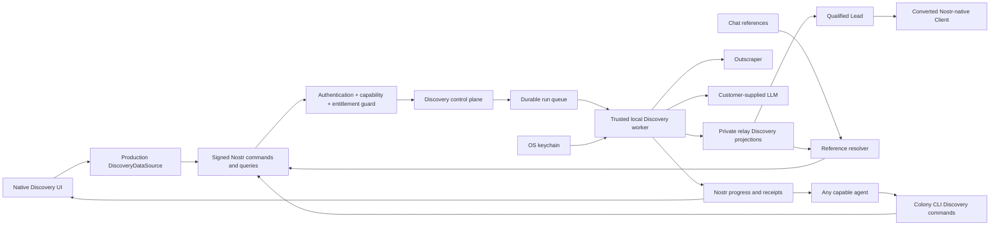

# Colony Discovery Production Phase One Design

**Date:** 2026-08-02

**Status:** Foundation implemented; live execution narrowed by the approved
Outscraper slice specification

**Live-slice specification:**
[`2026-08-02-colony-discovery-outscraper-businesses-design.md`](./2026-08-02-colony-discovery-outscraper-businesses-design.md)

**Repository:** `nocodeafrica/Colony`

**Design branch:** `codex/discovery-next`

## Purpose

Turn Colony's fixture-backed SalesTeams-style Discovery workspace into the
smallest production-capable business Discovery primitive without turning
Colony into a conventional CRM, copying SalesTeams' Supabase infrastructure,
or coupling the primitive to one agent.

Discovery remains one of Colony's intentional native work surfaces. People may
operate it directly, while any agent with the Discovery capability may operate
the same campaigns, runs, businesses, and leads through tasks and chat.

## Current-state map

### Colony `discovery-next`

The branch was inspected at `dc991576d`. It contains 44 files under
`desktop/src/features/discovery` and the complete fixture-backed Discovery
frontend merged through PR #2:

- Businesses and People entry surfaces;
- industry, vertical, and role taxonomy;
- Campaign list, creation, detail, Overview, Discovery, Leads, Outreach, and
  Conversations surfaces;
- source configuration for concurrent and waterfall modes;
- run timelines, progress, failure, fallback, partial, and cancellation states;
- a provider-neutral `DiscoveryDataSource` contract;
- deterministic fixtures and a local asynchronous progress stream;
- LAKA entitlement states and a zero-cost locked/demo experience.

It does not contain live provider adapters, durable run execution, private
Discovery persistence, a credential vault, a production entitlement authority,
agent commands, or chat references.

At the final audit the branch was clean and two commits behind current
`origin/develop`. It must be synchronized before implementation work or a pull
request, without overwriting concurrent work.

### Colony `discovery-engine`

The separately owned engine worktree was inspected read-only at `fa52ff60d`.
It was clean and still represented the earlier fixture/UI implementation. No
live-provider backend was committed at the time of the final audit.

That worktree remains owned by the other Claude session. This design does not
authorize changing it or duplicating work that appears there after this audit.
The owning session must inventory its current state before backend work begins.

### SalesTeams

The local SalesTeams repository was inspected through its active code paths,
including `lib/discovery/unified`, provider clients, campaign routes, session
streams, lead processing, lead storage, migrations, usage tracking, and credit
services.

SalesTeams currently provides:

- a broad industry and vertical taxonomy;
- Google Maps discovery through an Outscraper-first provider router;
- Brave and Exa web/company discovery;
- additional DataForSEO, OpenStreetMap, directory, and LinkedIn-related paths;
- provider pagination, caching, retry, rate-limit, and fallback behavior;
- concurrent and waterfall orchestration with configurable source ordering;
- live run events and SSE progress;
- qualification, rejection, deduplication, cross-source merging, and inline
  enrichment;
- durable Campaign, session, event, company, contact, and Campaign-item records;
- provider usage tracking and platform credit deduction;
- Supabase clients, tables, RLS assumptions, RPCs, service-role access, and
  Realtime or polling paths;
- Next.js route handlers, Trigger.dev jobs, and Jen-specific subscription gates.

## Reuse and replacement boundary

### Reuse from SalesTeams

- Industry and vertical definitions, after verifying product wording.
- Outscraper, Brave, and Exa request and normalization knowledge.
- Pagination, bounded retry, rate-limit, and fallback behavior.
- Concurrent and waterfall execution semantics.
- Run phase and progress vocabulary.
- Qualification prompts and structured result concepts.
- Provider identifiers, domains, locations, and normalized names used as
  business-identity evidence.
- Provider usage, provenance, and receipt concepts.
- Failure cases and production lessons encoded in tests and comments.

### Replace for Colony

- Supabase persistence, RLS, Realtime, RPC, and service-role access.
- Next.js API and SSE surfaces.
- Trigger.dev as required execution infrastructure.
- SalesTeams credits, per-lead charging, and top-up flows.
- Jen-specific authorization.
- Campaign-local duplicate linking or merging.
- Full provider payloads stored as ordinary Nostr events.

## Approved product contract

### Scope

- Phase One supports business Discovery only.
- People Discovery is disabled as a live capability and remains a demo or
  future surface.
- Live multichannel Outreach and Conversations are outside Phase One.
- Discovery ends with qualified Leads and explicit Lead-to-Client conversion.
- Converted Clients become ordinary core Colony company data.
- Discovery is not expanded into a click-heavy CRM pipeline.

### Commercial model

- Colony remains free.
- Live Discovery requires a paid monthly LAKA subscription.
- Colony does not charge usage fees or resell provider or LLM credits in Phase
  One.
- Customers bring their own Outscraper and LLM credentials for the first live
  slice. Future provider adapters require their own customer credentials.
- Free users see a clearly labelled, fixture-backed demo that makes no paid or
  production-store calls.
- Public price, billing vendor, and checkout are separate founder decisions.
- A manually provisioned entitlement is acceptable for the first paid pilot.

### Entitlement behavior

- Entitlement is provider-neutral to the Discovery engine.
- Every read, mutation, run start, run resume, and new paid batch is guarded.
- Revocation immediately prevents new provider and LLM calls and cancels active
  work.
- A third-party request already in flight may complete and incur its provider
  charge, but no later call or processing batch starts.
- Campaigns, runs, businesses, and unconverted Leads remain stored but locked
  while the subscription is inactive.
- Renewal restores access.
- Converted Clients remain accessible as core Colony data.

### Agent behavior

- Discovery is a generic capability, not a Lead Specialist-only integration.
- The out-of-box Lead Specialist receives the capability by default.
- Any other authorized agent may receive the same capability.
- Capability assignment is the operational approval boundary; there is no
  approval prompt for each run.
- Agents use the same service, limits, records, and entitlement checks as the
  native interface.
- Agents never receive provider or LLM secret values.

### Credentials and usage

- Provider and LLM credentials remain exclusively on the user's trusted
  device and are stored through the operating-system keychain.
- The Colony relay does not custody, encrypt, synchronize, or back up these
  credentials.
- A live run therefore requires an online trusted Colony desktop/local worker
  with the required keys configured.
- Secret values never enter Nostr events, chat, agent context, Campaign data,
  logs, exports, or provider receipts.
- Provider and LLM usage is recorded for transparency, debugging, budgets, and
  reconciliation, not Colony billing.
- Workspace administrators set hard usage ceilings. Campaigns may choose lower
  limits but cannot exceed workspace ceilings.

### Live-provider sequence

The first production slice has exactly one live business source: Google Maps
business discovery through Outscraper. Brave and Exa remain the next proposed
source adapters, but each requires a later acceptance gate. DataForSEO,
OpenStreetMap, saved directories, LinkedIn company search, and other providers
remain disabled adapter slots.

### Source execution

- The Outscraper slice has one source, so waterfall and concurrent modes have
  identical execution semantics.
- The existing source-mode contract remains intact for future adapters, but
  disabled future sources cannot be selected for a live run.
- Multi-source waterfall ordering and concurrent execution are proven only in
  later source-adapter gates.

### Qualification

- Direct LLM qualification uses a customer-supplied key and supports bounded
  concurrency.
- Agent CLI processes do not perform bulk qualification in Phase One.
- Live qualification requires a locally configured customer LLM key in this
  slice. Deterministic hard filters reduce unnecessary calls but do not replace
  the qualification verdict.
- Hard filters run before an LLM call.
- An AI verdict is structured, versioned, and preserves its reasons, supporting
  evidence, model identity, and prompt version.
- Clear passes automatically become Leads.
- Failed or uncertain candidates do not enter a manual review queue and do not
  count toward the Campaign target.
- Failed and uncertain candidates remain stored as paid-for audit and
  suppression records and may be explicitly reconsidered in a future flow.

### Ownership, retention, and deletion

- The customer owns the business dataset acquired with its provider and LLM
  spend.
- Purchased provider records, normalized data, qualification evidence,
  provenance, and run history have no automatic age-based deletion.
- Old data may be marked stale but is not automatically refreshed or deleted.
- Records are removed only through explicit administrator deletion or workspace
  deletion.
- Disposable transport material such as authorization headers, secret values,
  and unnecessary network-debug traces is never retained.
- Deleting Discovery data does not delete a Client already converted into core
  Colony data.

### Net-new and deduplication rules

- A Campaign target always means net-new qualified Leads.
- Deduplication is workspace-wide and runs immediately after provider
  normalization, before enrichment or LLM qualification.
- Matching considers provider identifiers, canonical domain, normalized
  location, normalized name, and other identity evidence.
- Existing Leads, dismissed Leads, converted Clients, and failed or uncertain
  candidates all remain in the suppression set.
- A duplicate is not saved or linked to the new Campaign, does not count toward
  the target, and does not receive another qualification call.
- The run records only the duplicate encounter and aggregate duplicate count.
- Discovery continues through pages and sources until it meets the net-new
  target, reaches a usage ceiling, is cancelled, or exhausts the market.
- Provider-side exclusion and pagination are used when available, but
  workspace-side identity resolution remains authoritative.

## Proposed architecture

### Nostr command and collaboration plane

Discovery introduces signed, workspace-scoped Nostr operations for Campaign
management, run control, authorized reads, Lead operations, and conversion.
Agent-facing operations are exposed through `buzz-cli` first and use the same
operations as the desktop adapter.

Nostr stores lightweight receipts, progress, terminal status, and opaque entity
references. Full provider records, qualification payloads, credentials, and
bulk Lead data do not become ordinary stored Nostr events. Chat Blocks resolve
opaque references through the entitlement-aware service.

The design does not require a new feature-specific HTTP API. New operations use
event kinds and relay handlers in accordance with Colony's Nostr-first
architecture.

### Private operational data plane

Colony-owned Postgres tables hold:

- Campaign definitions and qualification criteria;
- durable runs, leases, checkpoints, source attempts, and terminal states;
- provider observations and purchased payload data;
- canonical workspace business identities and suppression state;
- qualified Leads and failed or uncertain candidates;
- qualification inputs, outputs, evidence, model, and prompt version;
- usage units and provider receipts;
- provider job references and non-secret usage evidence.

The tables are accessed only through authenticated Colony services. They do not
copy SalesTeams Supabase clients, schemas, RLS, RPC, or service-role patterns.

### Durable execution worker

A bounded local worker executes paid provider and LLM calls outside the relay
request path. The relay retains the Postgres-backed queue, leases, fencing,
heartbeats, idempotency keys, and checkpoints. The Tauri worker is the first
implementation of a transport-neutral worker contract so a user-hosted daemon
can be added later without changing Campaign or agent commands.

If no trusted local worker is online, the run remains queued. If the worker
disconnects, it stops starting paid calls. A provider request identifier may be
checkpointed with the relay so a newly leased worker can resume polling an
already-paid request instead of submitting it again.

### Production adapter

The native frontend continues to depend on `DiscoveryDataSource`.

- Free and test contexts use the existing deterministic fixture adapter.
- Entitled workspaces use a production adapter backed by signed Colony
  operations.
- UI feature code never calls providers and never receives a stored secret back
  from the local credential service.

This preserves the frontend contract while replacing its data and execution
implementation.

## Execution flow

1. A person or capable agent creates a business Campaign with taxonomy,
   geography, qualification criteria, net-new target, source configuration,
   and usage ceilings.
2. A signed start command reaches the relay.
3. Authentication, workspace membership, Discovery capability, entitlement,
   credential readiness, idempotency, and limits are checked.
4. The control plane creates a durable run and enqueues it atomically.
5. The local worker claims the run through a lease and executes the enabled
   Outscraper source task.
6. Each provider batch records its usage receipt, and each returned candidate
   is normalized and identity-resolved.
7. Workspace duplicates record only a duplicate encounter against the existing
   identity; they do not create another business payload or Campaign link and
   are suppressed before hard filters or LLM calls.
8. Hard filters reject obvious mismatches.
9. Remaining candidates run through bounded direct LLM qualification with the
   customer's locally configured key.
10. A pass atomically preserves the new provider record, creates the canonical
    Business and Lead, and increments the Campaign's net-new result count.
11. A fail or uncertain verdict preserves the new purchased record in the audit
    and suppression set without creating a Lead.
12. Progress and terminal receipts flow through Nostr to native and agent
    clients.
13. The run stops at the first applicable terminal condition.
14. Explicit Lead conversion creates a core Nostr-native Client record while
    retaining Discovery provenance behind the paid boundary.

## Stop conditions and failure behavior

A run stops when any of the following occurs:

- the net-new qualified Lead target is reached;
- the configured provider candidate or page ceiling is reached;
- the configured LLM evaluation ceiling is reached;
- all enabled sources are exhausted;
- the user or agent cancels;
- entitlement is revoked;
- required credentials become invalid and no enabled source can continue;
- an unrecoverable internal error occurs.

Completed Leads and purchased observations are never discarded because a later
source or run step fails. Partial completion is a truthful terminal outcome.

Retries are provider-specific, bounded, and idempotent. Rate limits and
temporary failures produce backoff and visible progress. Permanent credential
errors disable only the affected source when other enabled sources can still
make progress. Worker lease expiry permits safe recovery without duplicating
paid batches or Leads.

## Phase One scope

### Included

- Business Discovery.
- Existing industry and vertical taxonomy.
- Outscraper as the only live provider adapter.
- Direct qualification through a locally configured customer LLM key.
- One-source execution while preserving the future multi-source contract.
- Durable, restart-safe Campaigns and runs.
- Live progress, cancellation, partial completion, and bounded retries.
- Workspace-wide suppression and net-new targets.
- Automatic Lead creation without manual review.
- Persistent failed and uncertain candidate evidence.
- Hard workspace and Campaign usage ceilings.
- Native UI, generic agent CLI, and chat-reference operation.
- Lead-to-Client conversion.
- Free zero-network fixture demo.
- Provider-neutral entitlement with immediate revocation behavior.

### Excluded

- Live People Discovery.
- LinkedIn company or People search.
- DataForSEO, OpenStreetMap, directory mining, and other provider adapters.
- Secondary People/contact enrichment and deep website crawling.
- Live Outreach, Conversations, or multichannel delivery.
- Outreach sequences and conventional CRM pipelines.
- Colony-supplied provider or LLM credits.
- Agent-CLI bulk qualification.
- Bulk data export.
- Automatic age-based deletion or refresh.
- Public checkout, a billing-vendor commitment, or invented pricing.

## Phase One acceptance gate

Phase One is production-capable only when all of the following are proven:

1. A paid pilot workspace configures real provider and LLM credentials without
   exposing them in events, chat, logs, or agent context.
2. A real Outscraper run produces net-new qualified Leads and stops at its
   target or reports truthful source exhaustion.
3. The relay never receives or stores the Outscraper or LLM secret values.
4. A second overlapping Campaign skips existing Leads, dismissed candidates,
   rejected candidates, and Clients and continues toward net-new results.
5. Duplicate candidates do not receive unnecessary LLM calls.
6. Batched LLM qualification uses the configured local key and does not run for
   candidates already suppressed by workspace deduplication.
7. Timeout, rate-limit, invalid-credential, and partial-source failures preserve
   completed work and produce truthful terminal states.
8. Killing and restarting the worker resumes safely without duplicate provider
   batches, LLM calls, or Leads.
9. Cancelling a run stops new external calls.
10. Revoking entitlement during a run stops it, locks Discovery reads and
    references, and leaves converted Clients accessible.
11. A capable agent creates, starts, monitors, and cancels the same Campaign
    visible in the native UI.
12. A Lead referenced from chat opens the authorized native record.
13. The free demo completes without provider, LLM, or production-store calls.
14. Usage records reconcile provider calls, LLM evaluations, duplicates,
    rejects, and saved Leads.
15. Browser proof demonstrates the live native flow and reports fixture proof
    separately.

Tests alone do not satisfy this gate. Evidence requires a real relay, durable
storage, controlled live-provider calls, restart fault injection, agent
operation, and native UI proof.

## Sequencing and worktree ownership

### 1. Freeze this design

Commit this specification on `codex/discovery-next`. Do not begin product code
until the user reviews the written specification.

### 2. Recheck the engine worktree

Before each implementation phase, inspect the other Discovery worktree for new
changes after the `fa52ff60d` snapshot. Do not modify it and do not duplicate
new work found there. At the approved live-slice design gate it remained clean
and contained only the already merged UI parity history.

### 3. Preserve the proven backend foundation vertical slice

Signed start, status, and cancel operations; private run persistence;
entitlement enforcement; a durable leased job; deterministic fake-source
progress; restart recovery; and matching CLI access are implemented on
`codex/discovery-next`. Keep this foundation green while extending its worker
contract; do not rebuild it in the other worktree.

### 4. Add the first live execution slice

Implement the trusted local worker contract and Outscraper adapter, then
bounded retries, cancellation, checkpoints, local keychain access, usage
evidence, qualification, global suppression, and Lead persistence. Brave,
Exa, and multi-source orchestration are separate later gates.

### 5. Add qualification and persistence

Implement canonical identity, global suppression, hard filters, direct BYOK LLM
qualification, Lead persistence, audit/suppression persistence, and Client
conversion.

### 6. Integrate human and agent surfaces

Implement the production `DiscoveryDataSource`, business-only live boundaries,
generic CLI/agent operations, and stable reference resolution against the same
landed contract. Keep the other Discovery worktree read-only.

### 7. Run the acceptance gate

Execute automated, fault-injected, live-provider, agent, and native browser
proof. Report implemented, locally tested, committed, merged, deployed, and
live-proven states separately.

## Next concrete worktree task

After the Outscraper slice specification is reviewed and its implementation
plan is approved, rebase `codex/discovery-next` onto current `origin/develop` and
extend the proven foundation with the transport-neutral local-worker claim,
heartbeat, checkpoint, and fenced-result protocol. Exclude the actual
Outscraper and LLM calls from that first implementation commit.

Its gate is a simulated local worker that claims a queued run, checkpoints a
non-secret provider job reference, survives disconnect/restart without duplicate
submission, rejects stale results, cancels immediately, and never sends a
fixture secret to the relay.

## Deferred founder decisions

The following decisions do not block the engine foundation:

- public monthly subscription price;
- billing and entitlement vendor;
- checkout and subscription-management experience;
- which customers enter the manually provisioned pilot.

People-data policy, bulk export, extra providers, Colony-supplied credits, and
live Outreach remain future-phase design decisions.
