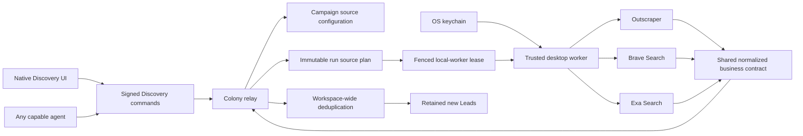

# Colony Discovery: Brave and Exa Provider Expansion

**Date:** 2026-08-03

**Status:** Approved for implementation planning

**Repository:** `AI-Native-Ventures/Colony`

**Branch:** `codex/discovery-brave-exa`

## Outcome

Make Colony's live Businesses Discovery genuinely multi-source. A paid user or
authorized agent can run a Campaign with Outscraper, Brave Search, and Exa
Search using customer-owned credentials stored on a trusted desktop device.

The user chooses one of two execution modes already represented by the native
Discovery UI:

- **Waterfall:** run the selected sources sequentially in the exact order the
  user configured, stopping before the next source once the net-new target has
  been reached.
- **Concurrent:** start all selected sources together. Results are normalized
  and deduplicated through the same relay-owned pipeline as they arrive.

This phase adds real provider acquisition and truthful multi-source progress.
It does not add People Discovery, Outreach, subscription checkout, Colony
usage credits, or LLM qualification.

## Settled product behavior

- Live Discovery remains gated by the existing LAKA entitlement.
- Customers pay Outscraper, Brave, and Exa directly through their own provider
  accounts. Colony does not sell or deduct usage credits.
- Each provider key remains in the operating-system keychain on the user's
  trusted device. Keys are not synchronized, uploaded, logged, added to Nostr
  events, exposed to agents, or returned to React after saving.
- A user selects which of the three live sources a Campaign uses.
- In waterfall mode, the user controls source order.
- In concurrent mode, all selected sources begin together; ordering has no
  execution meaning.
- The default new-Campaign configuration is waterfall with connected sources
  ordered as Outscraper, Brave, then Exa. The user may change the selection,
  order, or mode before starting.
- A source without a credential cannot be selected as usable on that device.
  If an existing Campaign references a credential that has since been removed,
  the UI blocks start and names the missing provider.
- Agent-started runs use the same persisted Campaign configuration. The relay
  assigns them only to a local worker that advertises all required provider
  capabilities without revealing secret values.
- Every provider result is normalized and checked against the workspace-wide
  suppression set. A business that already exists is not saved, linked to the
  new Campaign, or counted toward the target.
- New normalized businesses continue to become `new` Leads automatically,
  matching Colony's current production behavior.
- Provider results already paid for are retained. A concurrent run can finish
  with more Leads than its target when multiple in-flight requests return at
  nearly the same time. Colony does not discard those records.
- Cancelling a run or losing entitlement stops new provider calls immediately.
  Already accepted provider requests may still complete and may still incur
  customer cost.

## Current implementation boundary

Colony's existing production slice is intentionally Outscraper-only:

- `DiscoveryProvider` has only `Outscraper`.
- database constraints accept only the `outscraper` provider value;
- a run stores one business-search snapshot but no source selection or mode;
- the native worker loads only the Outscraper credential and owns one
  Outscraper client;
- its checkpoint sequence assumes a single asynchronous provider request;
- `discovery_usage` permits only one provider record per run;
- the live frontend rejects every source configuration except waterfall with
  `google_maps` alone;
- live Campaign projections synthesize an Outscraper-only source configuration
  rather than loading it from the relay.

The current provider-neutral `DiscoveryDataSource` and existing source editor
already support the desired frontend concepts. The production adapter and
relay contracts must now make those concepts durable and truthful.

SalesTeams provides useful request, response, pagination, normalization, and
source-mode knowledge. Colony will not copy its Supabase persistence, RLS,
Realtime/SSE transport, Redis cache, server environment-variable credentials,
platform credit deduction, Trigger.dev jobs, or LLM query multiplier.

## Approaches considered

### Chosen: relay-owned multi-source run plan

Persist the Campaign source configuration and snapshot it into every run. The
trusted local worker executes that durable plan while the relay remains
authoritative for leases, progress, deduplication, retained records, and
entitlement enforcement.

This is the only approach that keeps UI runs and agent runs identical, survives
desktop restarts, and does not repeat SalesTeams' Supabase architecture.

### Rejected: desktop-only provider fan-out

The desktop could call Brave and Exa and submit results without changing the
relay model. That would make source progress and configuration device-local,
allow agent runs to behave differently, and make restart recovery unreliable.

### Rejected: transplant SalesTeams orchestration

Copying the SalesTeams pipeline would import server-held secrets, Supabase,
Redis, credit accounting, and its LLM query multiplier. Those dependencies
conflict with Colony's Nostr-first and customer-key architecture.

## Architecture

## Source and provider vocabulary

The UI continues to use its existing source keys:

- `google_maps`
- `brave_search`
- `exa_search`

The durable worker/provider contract uses:

- `outscraper` for the `google_maps` source;
- `brave_search`;
- `exa_search`.

The distinction remains explicit because Google Maps is the source while
Outscraper is the provider used to acquire it.

DataForSEO, OpenStreetMap, directories, and LinkedIn remain catalogue entries
for the demo interface but are disabled and labelled unavailable in the live
source editor.

## Campaign and run contracts

Add strict provider-neutral source types to `buzz-core`:

- `DiscoverySourceMode`: `waterfall` or `concurrent`;
- `DiscoverySource`: `google_maps`, `brave_search`, or `exa_search`;
- `DiscoverySourceConfig`: a mode plus an ordered, unique, non-empty list of
  selected sources, with a maximum of three.

Campaign creation persists the source configuration. Add an idempotent
`update_campaign_sources` workspace operation so the existing editor can save
changes. Source configuration may be edited while a historical or active run
exists, but an active run never changes: every start action carries the exact
Campaign configuration and the relay stores an immutable run snapshot after
verifying it matches the Campaign.

For concurrent mode, the stored list remains stable for display and
fingerprinting even though its order does not affect execution.

The worker claim includes the list of provider capabilities configured on that
device. The relay returns only a run whose immutable plan is a subset of those
capabilities. This reveals credential presence, never values. A run with no
compatible online worker remains queued instead of being claimed and failed by
an unsuitable device.

## Source execution

### Waterfall

The coordinator processes the selected source list in order. Before beginning
each source it reads the authoritative retained Lead count. If the Campaign
target has already been reached, it marks later sources `skipped_target_met`
without contacting them.

A source can issue multiple bounded requests or pages. After every retained
batch, the coordinator checks cancellation, entitlement, lease ownership, and
target progress before starting another paid request.

If one source is exhausted or fails after bounded retries, the coordinator
records its truthful terminal state and continues to the next selected source.
The whole run fails only when no selected source can complete and no usable
result was retained. Otherwise it completes or completes partially with the
results already stored.

### Concurrent

The coordinator starts one bounded task per selected source under the same
fenced worker lease. One heartbeat loop maintains the lease; checkpoint writes
are serialized through the coordinator so sequence numbers cannot race.

Each source still obeys its own internal request and pagination limit. Once the
target is reached, the coordinator cancels pages and requests that have not
started. Calls already in flight may finish. Their returned, net-new records
are retained even when that makes the final Lead count exceed the target.

Failure of one concurrent source does not cancel successful sources. The run's
terminal state reflects the combined result and preserves per-source errors.

## Provider adapters

### Outscraper

Retain the existing asynchronous submit/poll adapter and opaque request-ID
recovery. Move it behind the shared source-runner interface without changing
its request bounds, redirect policy, response-size limit, or normalization.

### Brave Search

Use the current official Web Search HTTP endpoint with the key in the
`X-Subscription-Token` header.

- construct deterministic queries from Campaign vertical/query and geography;
- do not use an LLM query multiplier;
- request at most 20 web results per page;
- paginate only while `more_results_available` is true;
- never exceed offset 9;
- bound the number of pages by the remaining target and the Campaign limit;
- normalize only valid HTTP(S) results with a usable name or canonical domain;
- discard known search, social, directory, marketplace, listicle, and profile
  hosts before sending observations to the relay;
- retain title-derived name, canonical website, snippet, favicon/image when
  valid, query geography, source URL, and provider provenance.

### Exa Search

Use the current official `POST https://api.exa.ai/search` endpoint with the key
in the `x-api-key` header.

- use `category: company` and the provider's current recommended `auto` mode;
- make one bounded semantic company query per source attempt;
- request no more than the smaller of the remaining target and 100 results;
- do not request full page contents, summaries, or synthesized output in this
  phase;
- do not send `excludeDomains` with `category: company`, because Exa rejects
  that combination;
- filter known non-company hosts after receipt;
- retain provider request ID, title-derived name, canonical website, image or
  favicon when valid, query geography, source URL, and provider provenance;
- retain request counts but do not turn provider-estimated dollar values into
  Colony billing or a promised cost calculation.

## Normalization and deduplication

Generalize `DiscoveryBusinessObservationInput` so its deterministic identity
includes both provider and provider-record identifier. An Outscraper record and
a Brave or Exa web result must not collide merely because their provider-local
identifiers match.

Provider-record identifiers remain strict opaque values. When a provider uses a
URL as its identity, the worker sends a stable lowercase hexadecimal digest of
the canonical URL rather than weakening identifier validation to allow
arbitrary URLs.

Web-source observations may not contain Maps-specific fields. Add a bounded
description/snippet field for Brave and Exa while preserving all existing Maps
fields.

Workspace-wide suppression remains authoritative and provider-neutral. Exact
provider identity is the strongest same-provider key; canonical domain is the
strongest cross-provider key. Existing exact phone and normalized name plus
locality checks continue to apply. Fuzzy name-only matching does not suppress a
record.

The first retained observation remains the canonical Lead source. A later
cross-provider duplicate is counted for run/source metrics but is neither saved
again nor linked to the later Campaign.

## Durable persistence and recovery

Add a new forward-only migration that:

- stores mode and source order on `discovery_campaigns`;
- stores the immutable source snapshot for each run;
- widens provider constraints to Outscraper, Brave, and Exa;
- makes usage and observation-batch identities provider-aware so one run can
  contain multiple provider requests;
- stores per-source status, position, request/page cursor, returned count,
  retained count, duplicate count, failure class, and timestamps;
- preserves every existing Outscraper row and projection unchanged;
- adds the bounded optional description field;
- does not store credentials, authorization headers, raw response bodies, or
  arbitrary provider payloads.

Outscraper resumes from its provider request ID. Brave and Exa are synchronous
paid calls without a provider-supported idempotency key. The worker therefore
records a call intent before sending it and writes normalized results into a
workspace-scoped crash-safe local outbox immediately after receipt. It drains
that outbox idempotently into the relay before issuing more calls.

If the process dies after a synchronous provider accepted a request but before
any response can be written locally, the attempt is `outcome_unknown` and is
not repeated automatically. Avoiding a possible duplicate charge takes
priority over silently repeating an ambiguous paid call. A later explicit run
may search again.

The local outbox contains only the same normalized, bounded public business
fields accepted by the relay. It never contains provider keys, headers, or raw
payloads and is removed after an acknowledged idempotent relay write.

## Credentials and Settings

Generalize the current status-only credential module to a strict provider enum
and three distinct OS-keychain entries:

- `discovery.outscraper.api_key`
- `discovery.brave_search.api_key`
- `discovery.exa_search.api_key`

React receives one status per provider. Save operations accept a provider and
new value, store and verify it inside the native process, then return only
status. Delete remains idempotent. Secret values are zeroized after use.

The Settings screen displays three consistent provider rows with connected,
not-connected, or secure-storage-unavailable states. Saving a key never makes a
network request or starts Discovery. Replacing or deleting a key wakes the
worker and refreshes source availability.

## UI behavior

Remove the current live Outscraper-only resets and errors. Reuse the existing
source editor and mode controls:

- switches select Outscraper, Brave, and Exa;
- waterfall permits drag-to-reorder selected sources;
- concurrent disables reordering and explains that all selected sources start
  together;
- unavailable credentials disable the corresponding switch and link the user
  to Discovery Settings;
- saving source configuration updates the relay-backed Campaign;
- the run timeline and source table show real provider-specific pending,
  active, completed, exhausted, failed, and skipped states;
- Lead rows expose the actual first source and source label rather than always
  reporting Outscraper;
- free/demo behavior and its fixture scenarios remain unchanged and make no
  credential, live-store, or provider calls.

## Failure and retry policy

Provider errors are converted into privacy-safe stable classes:

- `credential_rejected`;
- `billing_required` or provider budget exhausted;
- `invalid_request`;
- `rate_limited`;
- `provider_unavailable`;
- `response_too_large`;
- `request_timed_out`;
- `malformed_response`;
- `outcome_unknown`;
- `cancelled`.

Authentication, billing, permission, invalid-request, and malformed-response
failures are terminal for that source. Rate limits and temporary 5xx failures
receive bounded exponential backoff with provider `Retry-After` guidance when
available. Retrying is always preceded by a current lease, cancellation, and
entitlement check.

Raw provider error bodies are not logged or sent through Nostr because they can
echo request details. User-visible errors name the provider and the action the
user can take without exposing secrets.

## Explicitly excluded

- People Discovery;
- LLM qualification, qualification keys, prompts, and verdict persistence;
- agent CLI processes performing provider calls;
- DataForSEO, OpenStreetMap, directories, LinkedIn, or other live adapters;
- website crawling, deep content retrieval, contact discovery, and enrichment;
- Outreach, Conversations, sending, and CRM stages;
- Colony provider credits, cost resale, checkout, public pricing, or a billing
  vendor;
- relay custody or synchronization of customer provider credentials.

## Acceptance gate

Implementation is complete only when all of the following are proven:

1. The branch remains based on current `origin/develop`, and no preserved
   uncommitted worktree is modified.
2. Campaign create, read, and source-update operations persist a strict source
   configuration; every run has an immutable matching snapshot.
3. Outscraper, Brave, and Exa credentials use separate OS-keychain entries and
   only status crosses native IPC.
4. Secret fixtures appear zero times in Nostr events, database rows, logs,
   outbox files, screenshots, and agent/CLI output.
5. Loopback provider tests prove Brave authentication, pagination, target
   bounds, URL filtering, response-size limits, error classification, retries,
   and cancellation without paid calls.
6. Loopback provider tests prove Exa authentication, current request shape,
   100-result bound, company filtering, response-size limits, error
   classification, retries, and cancellation without paid calls.
7. Waterfall executes only selected sources, in the saved user order, and never
   starts a later source after the target is reached.
8. Concurrent starts every selected source, serializes checkpoints safely,
   cancels not-yet-started calls after target completion, and retains valid
   in-flight results even when the target is exceeded.
9. Cross-provider workspace deduplication prevents the same domain from being
   saved or linked twice and records a duplicate encounter against the later
   source.
10. Restart tests prove Outscraper request resumption, Brave/Exa outbox draining,
    no repeated ambiguous synchronous call, idempotent batches, and no duplicate
    Leads.
11. Cancellation, entitlement revocation, lost leases, one-provider failure,
    all-provider failure, source exhaustion, and missing credentials produce
    truthful run and source states while preserving completed results.
12. The native UI proves three-provider Settings, source selection, waterfall
    reordering, concurrent mode, persisted Campaign configuration, real source
    progress, and correct Lead provenance.
13. A generic capable agent can start, inspect, and cancel the same persisted
    multi-source Campaign without receiving provider credentials.
14. Existing Outscraper-only Campaigns and runs remain readable and executable
    after migration.
15. Empty-database and upgraded-database migration tests, focused Rust and
    desktop tests, real-relay fault-injection proof, and full `just ci` pass.
16. With explicit customer approval and strict small caps, separate real Brave
    and Exa smoke runs prove current provider compatibility. These paid proofs
    are reported separately from loopback and mocked evidence.

Code written, locally tested, committed, merged into `develop`, promoted to
`main`, released, and proven against real provider accounts remain separate
delivery states.

## Measured implementation evidence — 2026-08-03

The implementation branch passed its local production gate with customer-owned
provider calls disabled:

- `scripts/discovery-multi-source-proof.sh` passed against a real local relay.
  It exercised an agent-started run, persisted waterfall and concurrent plans,
  capable/incompatible worker matching, cancellation, entitlement revocation,
  lease loss, restart recovery, provider failure, overshoot, cross-Campaign
  deduplication, and credential privacy. The proof also caught and corrected a
  transactional bug where an agent cancellation stopped the run but did not
  initially stop its per-source rows.
- Focused tests passed: 16 `buzz-core` Discovery tests, 17 `buzz-sdk` tests,
  3 non-ignored plus 8 real-Postgres `buzz-db` Discovery tests, 6
  `buzz-relay` tests, 1 `buzz-cli` test, and 86 native desktop Discovery tests
  with 2 infrastructure tests intentionally ignored.
- The 8 real-Postgres tests ran sequentially in an isolated disposable
  database. They include migration from schema 0038 with representative legacy
  Outscraper Campaign, run, checkpoint, observation, usage, and batch records.
  A separate isolated empty-database migration test also passed. Both temporary
  databases were dropped after the tests.
- Desktop lint and typecheck passed. The Discovery Playwright journey passed,
  and 17 captured UI states had 17 distinct SHA-256 hashes.
- `just ci` passed in full: formatting, strict Rust lint, desktop and web
  checks/builds, 4,089 desktop unit tests, 2,034 native desktop tests, and 915
  mobile tests passed.
- `just test` passed every branch-relevant unit and database step, then stopped
  in the unrelated `buzz-agent` `fake_llm` suite at
  `cancelled_turn_with_usage_emits_notification_before_response`. The same
  parallel-only failure reproduces on clean `develop`, while the test passes in
  isolation; this is recorded as a baseline shared-state race and was not
  changed on this branch.
- `git diff --check` passed. Test artifacts contained no credential sentinel,
  no screenshot was tracked, and all credential sentinel occurrences in the
  branch diff are deliberate test declarations or invalid-schema fixtures.
  Other worktrees were inspected and left untouched.

No real Brave or Exa API request was made. Current provider compatibility with
customer accounts remains a separate paid smoke gate requiring explicit
approval and strict result caps. This evidence proves the branch locally; it
does not claim merge to `develop`, promotion to `main`, release, or live paid
provider proof.
