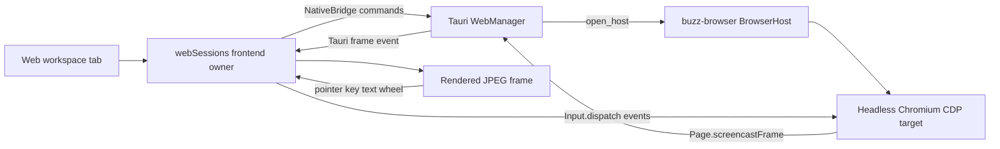

# Workspace web tab reconciliation and packaged proof

Date: 2026-08-10
Status: Approved for implementation

## Objective

Reconcile the existing default-off `web` workspace-tab spike onto the terminal
tab now merged in `develop`, then prove the real Tauri path: Colony launches an
owned headless Chromium through `buzz-browser`, renders a CDP screencast inside
the workspace, forwards input back to the page, and tears the browser process
down at every lifecycle boundary.

This phase does not migrate the shell, add Electron, replace `buzz-browser`, or
enable the feature by default.

## Reconciliation

The spike contains two web commits above the pre-salvage terminal head. Replay
only those web commits and this design commit onto `origin/develop`; do not
replay the terminal commits already present through PR #204. Preserve the
merged terminal implementations when resolving shared registry, native state,
community-reset, shutdown, Playwright, and inventory files. Regenerate derived
inventory after the source reconciliation instead of hand-merging its counts.

## Product architecture

The workspace shell remains kind-agnostic. The existing `web` registration
supplies its body and dispose hook through the tab-kind registry.

`workspaceWebTab` stays in `preview-features.json` with
`defaultEnabled: false`. The packaged proof enables it only in the isolated
harness application's localStorage before reloading the webview. A normal
installation sees no Web option unless the user explicitly enables the
preview.

Relay-synchronized payloads may contain only endpoint, target id, and URL. The
native layer owns browser binary discovery and forces owned launches headless,
so a restored payload cannot execute an arbitrary binary or steal focus.

## Packaged Tauri journey

Add real-shell flow 08. Its Node test process starts a deterministic HTTP
fixture on `127.0.0.1` using an ephemeral port and shuts it down in `finally`.
The fixture contains a visually distinct page with a text field, action button,
status panel, and scrollable region. It records browser requests that prove
which page-side events occurred.

The flow:

1. Completes isolated harness onboarding when necessary.
2. Enables only `workspaceWebTab` in the harness feature override and reloads.
3. Opens the channel workspace, creates a Web tab, enters the fixture URL, and
   leaves the DevTools endpoint empty so Colony owns the browser launch.
4. Waits for a real non-empty screencast frame and the running-session marker.
5. Sends a pointer click to the remote field, types `colony-web`, sends wheel
   input, and clicks the remote action button.
6. Requires the fixture server to observe the exact value `colony-web` once,
   plus pointer/action and scroll receipts. This catches missing forwarding and
   duplicate printable insertion.
7. Waits for the updated real frame and captures `08-web.png`, which must visibly
   show the fixture's PASS state inside the Colony Web tab.
8. Closes the tab and proves the owned Chromium leader and descendants disappear
   with explicit `kill-0=false ps=absent` output.
9. Starts a second owned session, switches communities, proves the old browser
   tree is gone before the new community readiness marker, then starts a third
   session and proves app quit removes that browser tree as well.

The native start result exposes the owned browser PID as runtime observability;
attached sessions return no owned PID and are never killed by Colony. The
frontend may surface that PID only as a data attribute used by the packaged
proof, not in persisted tab payloads.

## Failure handling and lifecycle

- Existing frontend tab/reset generations reject late starts and close any
  native session that resolves after invalidation.
- Existing native start generations cancel and drain pending host creation.
- Tab close awaits the session task before returning.
- Community reset calls `workspace_web_close_all` before the new community is
  applied.
- App shutdown stops screencasting, drains the session task, drops the owned
  `BrowserHost`, and waits for process disappearance in the packaged proof.
- Attached DevTools hosts remain external-owned and survive Colony teardown.
- CDP command, acknowledgement, start, and close operations remain bounded; a
  timeout becomes an explicit Web-tab error instead of an indefinite hang.

## Acceptance gates

No broad local `just ci` is permitted for this phase.

Focused local gates:

- direct-loader web session and registration tests, including captured
  red-before-green for any new regression;
- focused `WebManager` and `buzz-browser` tests;
- typecheck, harness typecheck, NativeBridge boundary, px-text, file-size, and
  native-inventory drift checks;
- `pnpm build:e2e` plus the registered mock Web-tab Playwright spec;
- one packaged build, followed by flow 08 reruns with `--no-build`;
- a visually inspected, non-blank `08-web.png` posted to the PR through
  `scripts/post-screenshots.sh`;
- explicit browser PID disappearance for tab close, community reset, and app
  quit.

Hosted PR CI and the merge queue are the broad acceptance gates. The PR is not
called green or merged until every non-skipped hosted check passes and GitHub
reports the final merge state.

## Out of scope

- Electron or any shell migration.
- Making the Web tab stable/default-on.
- Rebuilding browser navigation, snapshot, journey, or MCP capabilities.
- Production relay, DNS, paid services, visible/focus-stealing browser windows,
  or internet-dependent fixtures.
- Unrelated decomposition of legacy oversized files.
