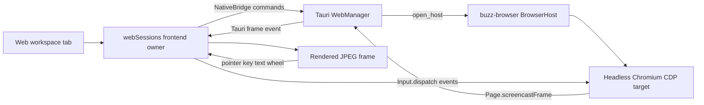

# Workspace web tab reconciliation and packaged proof

Date: 2026-08-10
Status: Approved for implementation

## Objective

Reconcile the existing default-off `web` workspace-tab spike onto the terminal
tab now merged in `develop`, then prove the real Tauri path: Colony launches an
owned headless Chromium through `buzz-browser`, renders a CDP screencast inside
the workspace, forwards input back to the page, and tears the browser process
down at every lifecycle boundary.

This phase does not migrate the shell, add Electron, replace `buzz-browser`, or
enable the feature by default.

## Reconciliation

The spike contains two web commits above the pre-salvage terminal head. Replay
only those web commits and this design commit onto `origin/develop`; do not
replay the terminal commits already present through PR #204. Preserve the
merged terminal implementations when resolving shared registry, native state,
community-reset, shutdown, Playwright, and inventory files. Regenerate derived
inventory after the source reconciliation instead of hand-merging its counts.

## Product architecture

The workspace shell remains kind-agnostic. The existing `web` registration
supplies its body and dispose hook through the tab-kind registry.

`workspaceWebTab` stays in `preview-features.json` with
`defaultEnabled: false`. The packaged proof enables it only in the isolated
harness application's localStorage before reloading the webview. A normal
installation sees no Web option unless the user explicitly enables the
preview.

Relay-synchronized payloads may contain only endpoint, target id, and URL. The
native layer owns browser binary discovery and forces owned launches headless,
so a restored payload cannot execute an arbitrary binary or steal focus.

## Packaged Tauri journey

Real-shell flow 08 is deliberately one proof wide. Its Node process serves a
static, visually distinct page from `127.0.0.1` on an ephemeral port and shuts
the server down in `finally`. The fixture has no coordinate receipts or input
state.

The flow:

1. Completes isolated harness onboarding when necessary.
2. Enables only `workspaceWebTab` in the harness feature override and reloads.
3. Opens the channel workspace, creates a Web tab, enters the fixture URL, and
   leaves the DevTools endpoint empty so Colony owns the browser launch.
4. Requires the native running-session marker and one non-empty real
   `Page.startScreencast` frame that fills the workspace surface.
5. Captures exactly one `08-web.png` screenshot.

Pointer, wheel, key, and text behavior are intentionally absent from this
journey; the matching Chromium/WebKit Playwright projects own them. PID/profile
teardown on close, reset, cancellation, timeout, and quit is intentionally
absent too; the real-Chromium Rust lifecycle tests own it. A Flow 08 failure can
therefore mean only that the signed bundle did not cross real Tauri IPC into
the browser host or did not render the returned frame.

The native start result exposes the owned browser PID as runtime observability;
attached sessions return no owned PID and are never killed by Colony. The
frontend may surface that PID only as a data attribute used by the packaged
proof, not in persisted tab payloads.

## Failure handling and lifecycle

- Existing frontend tab/reset generations reject late starts and close any
  native session that resolves after invalidation.
- Existing native start generations cancel and drain pending host creation.
- Tab close awaits the session task before returning.
- Community reset calls `workspace_web_close_all` before the new community is
  applied.
- App shutdown stops screencasting, drains the session task, drops the owned
  `BrowserHost`, and waits for process disappearance in the packaged proof.
- Attached DevTools hosts remain external-owned and survive Colony teardown.
- CDP command, acknowledgement, start, and close operations remain bounded; a
  timeout becomes an explicit Web-tab error instead of an indefinite hang.

## Acceptance gates

No broad local `just ci` is permitted for this phase.

Focused local gates:

- direct-loader web session and registration tests, including captured
  red-before-green for any new regression;
- focused `WebManager` and `buzz-browser` tests;
- typecheck, harness typecheck, NativeBridge boundary, px-text, file-size, and
  native-inventory drift checks;
- `pnpm build:e2e` plus the `engine-chromium` and `engine-webkit` Web-input
  projects, with a total iteration under one minute;
- one packaged build and one Flow 08 run for final bundle acceptance, not as an
  implementation loop;
- a visually inspected, non-blank `08-web.png` posted to the PR through
  `scripts/post-screenshots.sh`;
- explicit browser PID/profile disappearance in the Rust lifecycle layer for
  tab close, community reset, cancellation/timeout, and app quit.

Hosted PR CI and the merge queue are the broad acceptance gates. The PR is not
called green or merged until every non-skipped hosted check passes and GitHub
reports the final merge state.

## Amendments after first packaged run

### Browser chrome and responsive viewport (commits 44055c13f1, 31d209a304, ff3ec194b3)

The spike's toolbar exposed the DevTools endpoint and target id as primary
controls and let the screencast image letterbox inside the panel. Shipped
instead: Back, Forward, Reload, a single URL field with a visible Go control,
and the endpoint/target attach controls collapsed under an "Advanced
connection" disclosure that is closed by default. The screencast surface fills
the workspace panel, and a `ResizeObserver` drives `workspace_web_resize` so
Chromium's CDP viewport tracks the panel instead of the image being stretched
or cropped.

Two native commands were added for this: `workspace_web_back`,
`workspace_web_forward`, `workspace_web_reload`, and `workspace_web_resize`.

### Wheel forwarding opt-out (commit b4458f2b66)

`useWebviewScrollBoundaryLock` registers a window-capture, `passive: false`
wheel listener that calls `preventDefault()` and `stopPropagation()` on any
wheel whose event path contains no scrollable element. The screencast surface
is deliberately `overflow-hidden`, so it matched that rule and every wheel over
the Web tab was consumed before React's `onWheel` could run. Remote scrolling
never worked, in any environment. This was previously misdiagnosed as a
packaged WebKit/Tauri boundary limitation.

Surfaces that forward wheel gestures somewhere else now opt out with
`data-buzz-wheel-forwarding`, matching the existing
`data-buzz-conversation-scroll` exemption idiom. Rubber-band protection is
unchanged and `tests/e2e/overscroll-boundary.spec.ts` still passes.

### Proof layering

The packaged WDIO journey is no longer the place where input and lifecycle are
iterated. Engine input behaviour is proven by the `engine-chromium` and
`engine-webkit` Playwright projects, because WebKit is the engine behind the
packaged macOS WKWebView. Owned-browser process lifecycle is proven by Rust
integration tests against real headless Chromium. Flow 08 keeps only the proof
that requires the signed bundle: real Tauri IPC producing a real CDP frame
inside the packaged app, plus one screenshot. Any loop iteration over one
minute is a harness defect to fix before changing product code.

## Out of scope

- Electron or any shell migration.
- Making the Web tab stable/default-on.
- Rebuilding browser navigation, snapshot, journey, or MCP capabilities.
- Production relay, DNS, paid services, visible/focus-stealing browser windows,
  or internet-dependent fixtures.
- Unrelated decomposition of legacy oversized files.
